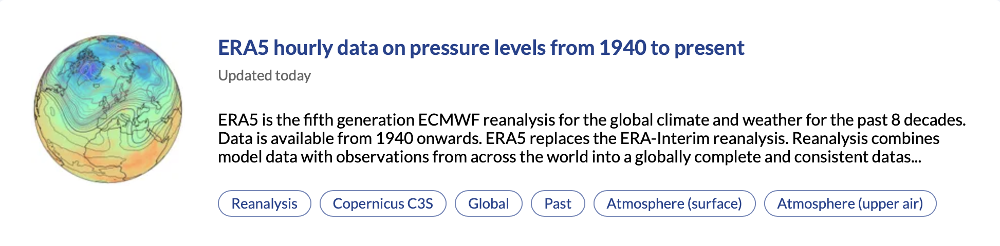
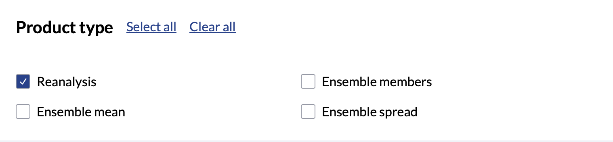
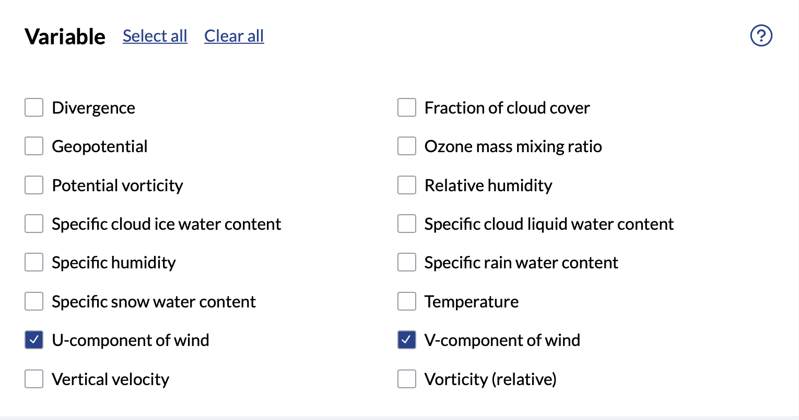
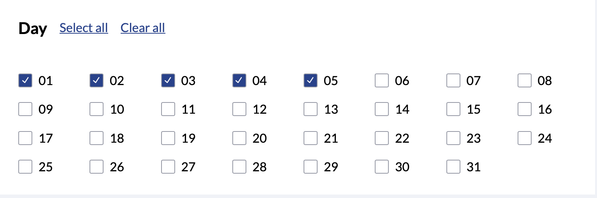
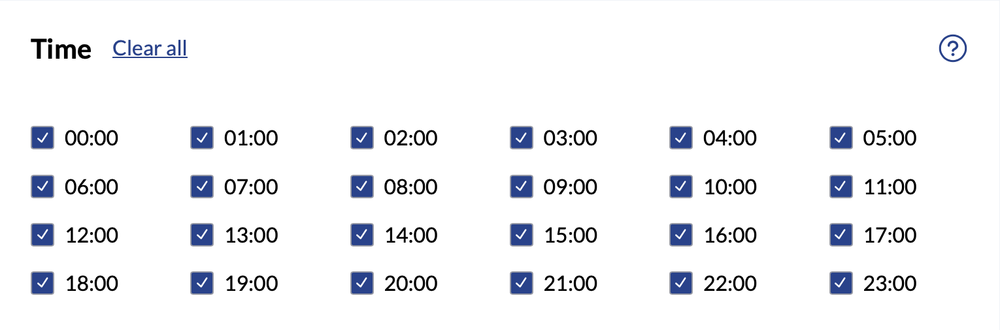
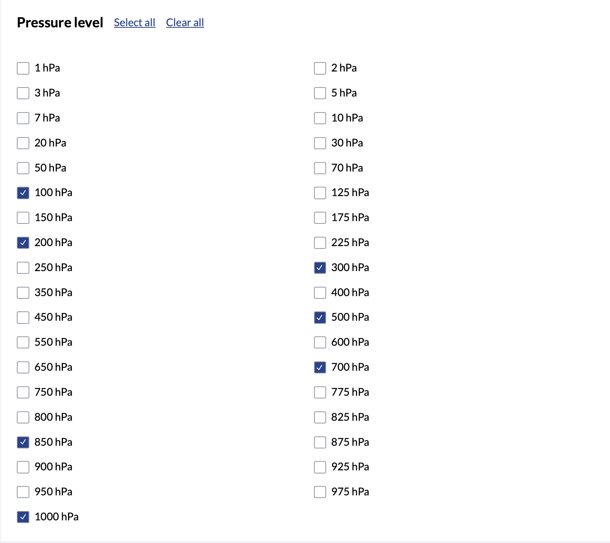
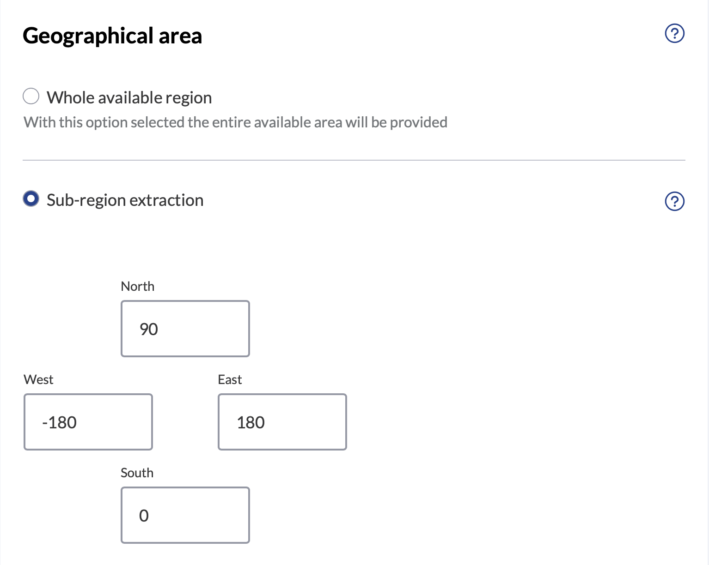
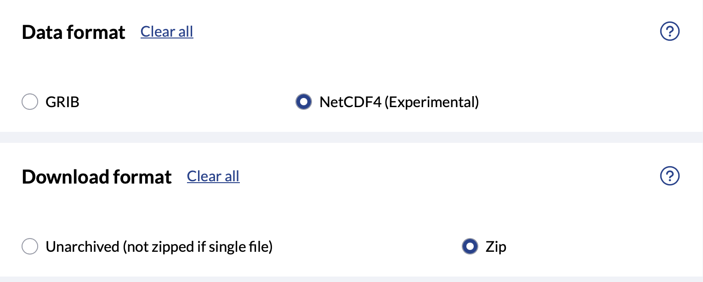
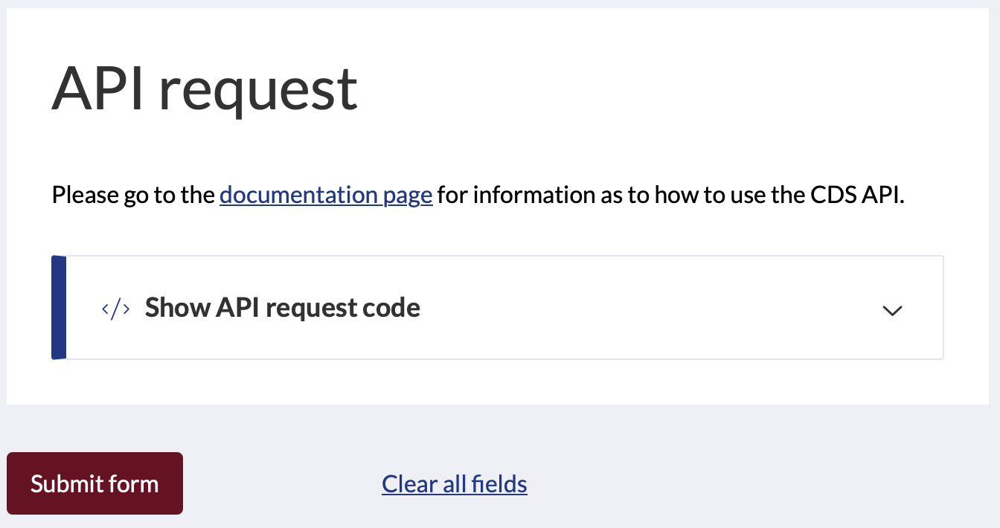
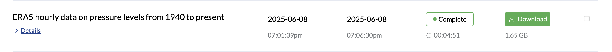

# ERA5 dataset

- Datasets can be found in the [website](https://cds.climate.copernicus.eu/datasets).
- You need to register and login.
- We use the dataset **ERA5 hourly data on pressure levels from 1940 to present**.


## What to choose





- We will use two weeks starting sometime in July. For now, I downloaded only for 5 days to handle it easily.








## Download dataset
- You can either use the API request or download it from the ***Your requests*** in the website (you need to wait until you get approval):



## How can we use ERA5 dataset?
- You can check the file ```ERA5_demo.ipynb```
