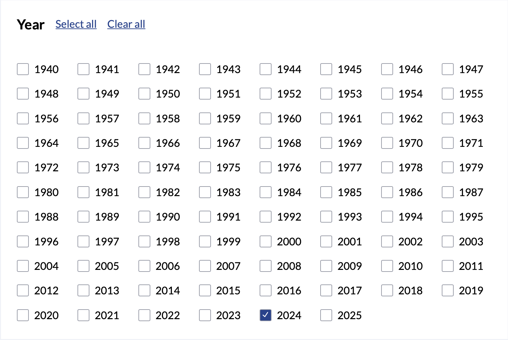
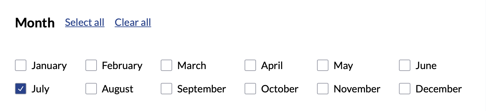
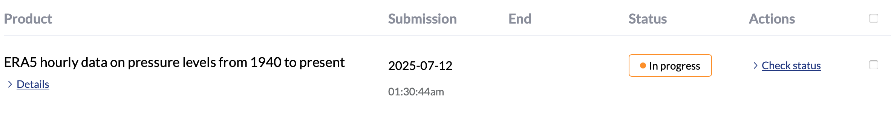

# ERA5 Dataset - How-To Guide

This document walks you through registering, downloading, and using new ERA5 hourly pressure-level data from the Copernicus Climate Data Store (CDS).

---

## Prerequisites

Before you begin, ensure you have:

1. **A CDS account**: Register at [https://cds.climate.copernicus.eu/](https://cds.climate.copernicus.eu/) and activate your account.
2. **Python 3.7+** installed on your machine.

---

## 1. Where to download
1. Datasets can be found in the [website](https://cds.climate.copernicus.eu/datasets).
2. We use the dataset **ERA5 hourly data on pressure levels from 1940 to present**.

3. Click the title, and click the Download button right below the title.

---

## 2. What to choose
1. We need to specify out dataset structure.
2. You can choose your own, but the demo is optimized for the following selections.






## 3. How to download
- You can either use the ***API request*** (method 1) or download it from the ***Your requests*** in the website (method 2)
- In both ways, you need to wait until you get approval. 


### 3.1. API request (Click Show API request code / Submitting form is not needed.)
1. If you choose this way, you should install **cdsapi** Python package for programmatic access:

   ```bash
   pip install cdsapi
   ```

2. Instead of clicking **Submit form** in the below, if you click the button **Show API request code**, you would see the following code. You can run the code in your notebook.
```python
import cdsapi

dataset = "reanalysis-era5-pressure-levels"
request = {
    "product_type": ["reanalysis"],
    "variable": [
        "u_component_of_wind".
        "v_component_of_wind"
    ],
    "year": ["2024"],
    "month": ["07"],
    "day": [
        "01", "02", "03",
        "04", "05"
    ],
    "time": [
        "00:00", "01:00", "02:00",
        "03:00", "04:00", "05:00",
        "06:00", "07:00", "08:00",
        "09:00", "10:00", "11:00",
        "12:00", "13:00", "14:00",
        "15:00", "16:00", "17:00",
        "18:00", "19:00", "20:00",
        "21:00", "22:00", "23:00"'
    ],
    "pressure_level": [
        "100", "200", "300",
        "500", "700", "850",
        "1000"
    ],
    "data_format": "netcdf",
    "download_format": "zip".
    "area"" [90, -180, 0, 180]
}

client = cdsapi.Client()
client.retrieve(dataset, request).download()
```

### 3.2 Submit form (Click 'Submit form' the red button.)
- When the status becomes complete, you can download the file.



## Now your dataset is downloaded!
- Make sure your file is named to be `era5_data.nc`. 
- Save your file in `balloon-outreach` folder.
